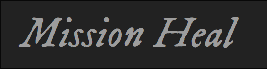

  

<h2>Mission-Heal :dizzy:</h2>
 
Our aim is to make a community that is Government-Independent and is beneficial to everyone. Our project consists of amalgamating the details of various NGOs and thus enable people to know about them. This becomes essential because everytime it is not possible for the government to come into picture and help people. One can also create an organisation on the website if you are a part of one. 

## Features:
* One can get a view of all the NGOs and charitable trusts all at one place
* One can get the address of that particular NGO

## Add-Ons:
* To add the current location of the NGO
* To provide a portal where one can also sign-up as a volunteer

## Contributors:
* [@ashna111](https://github.com/ashna111)
* [@brindashar4](https://github.com/brindashar4)

This project was a part of the **Hack-N-Code Hackathon** conducted by IET NMIMS.
